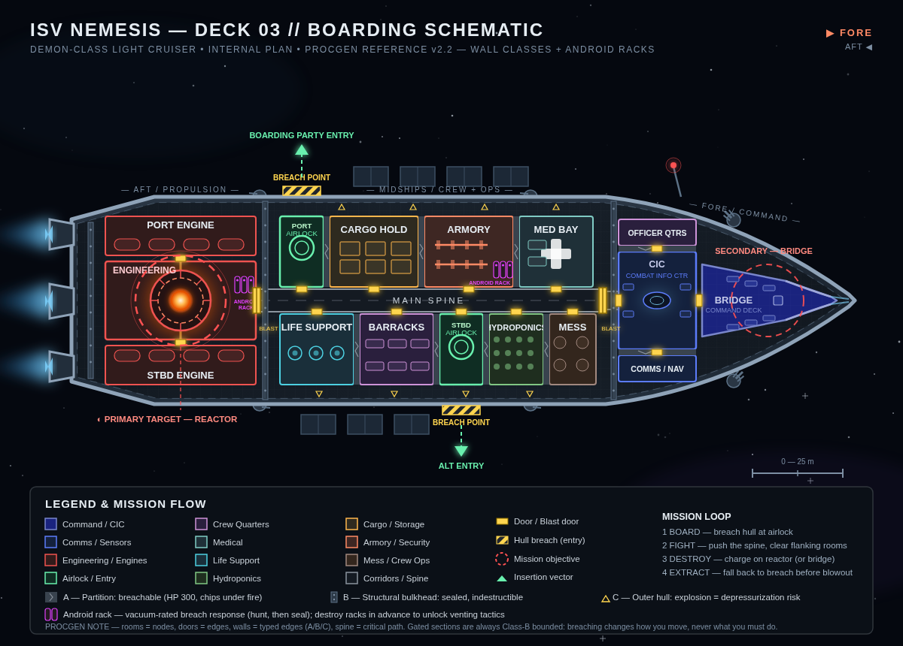

# Boarding Mission Gameflow — Design Document

**Project:** Untitled Boarding Shooter (working title: *Nemesis Protocol*)
**Genre:** Top-down co-op tactical shooter (Alien Swarm lineage)
**Engine / Platform:** three.js (WebGL2/WebGPU, browser)
**Camera:** angled top-down, Alien Swarm-style (~60° pitch, perspective projection) for the prototype. A first/third-person pivot is a **post-P1 evaluation** (§12.1) — authoring rules in `visual_direction.md` §8 keep that option open.
**Input:** keyboard/mouse **and gamepad as first-class citizens** — full action parity, twin-stick aiming, hot-swap at any time (§8, §9).
**License:** open source — MIT (code) / CC BY 4.0 (assets). See `LICENSE` / `LICENSE-ASSETS`.
**Scope of this document:** Single-mission gameflow for the core loop — *board an enemy capital ship, fight through it, destroy it, get out.*
**Reference asset:** `assets/mockups/cruiser_boarding_deck_plan.svg` — ISV *Nemesis*, Deck 03 (procgen reference layout)
**Status:** v1.12 — locked for prototype (enemy roster approved)

---

## 1. Design Pillars

1. **No straight lines.** The shortest path from entry to objective must never be the playable path. Gating forces full-ship traversal.
2. **The ship is the antagonist.** Lockdowns, venting, fires, and sealed doors are systemic responses to the players' presence, not scripted set dressing.
3. **The way out is not the way in.** Extraction must recontextualize cleared space — repopulated, collapsing, and rerouted.
4. **Agency through soft pressure.** Players choose the order of operations; each choice trades speed against resistance.
5. **Geometry is negotiable — at a price.** Walls, doors, and even the hull are part of the tactical space. Players may reshape the map, but every change is loud, two-way, and permanent.

---

## 2. The Core Problem

> A naive layout (breach → corridor → reactor → leave) produces a 90-second speedrun mission. The map's geometry becomes irrelevant; players skip 80% of the content.

The solution is a **lock-and-key structure distributed across ship sections**, plus **escalating systemic pressure** so that rushing is possible but self-punishing.

---

## 3. Mission Structure

### Phase 0 — Approach & Breach Selection

- The squad selects one of **two breach points** on the target hull:
  - **Port breach** → enters adjacent to Cargo Hold / Armory. Loot-rich route, heavier patrol density.
  - **Starboard breach** → enters adjacent to Life Support / Barracks. Softer initial resistance, fewer resources.
- Breach point selection is the mission's first meaningful decision and should be visible on the briefing screen.

### Phase 1 — Insertion & Foothold (quiet → loud)

- Airlock cycle provides a **stealth window**: enemies are on patrol routes, unaware.
- Stealth ends on first contact, first camera/hull-sensor trip, or first fired shot → **ALARM**.
- The alarm is the master trigger for the entire mission structure (see §4).

### Phase 2 — Lockdown (hard gate #1)

- On alarm: **ship-wide lockdown.** Section blast doors seal; Engineering enters containment.
- **The reactor is physically unreachable from this point until Phase 4 conditions are met.** This is a hard rule, not a difficulty slider.
- Objective issued: reach the **CIC (fore)** and slice the security network.
- Critical path so far: *breach amidships → fight full-length fore*. The spine is established as the mission's main artery.

### Phase 3 — Reactor Access (two-key gate)

The aft blast door requires **two independent conditions**. Neither alone is sufficient.

| Condition | Location | Section | Action |
|-----------|----------|---------|--------|
| A — Security override | CIC / Bridge | **Fore** | Timed hack (defend the slicer) |
| B — Coolant vent | Life Support | **Midships** | Manual vent procedure (hold interaction, interrupted by damage) |

- **Co-op rule:** Conditions A and B must be completed within a shared window (default: 30 s). This forces the squad to split — the core tension beat of the mission.
- Solo fallback: conditions may be completed sequentially, but the first completed condition starts a decay timer.
- On completion: aft blast door opens with a ship-wide announcement. The enemy *knows* where you're going.

### Phase 4 — Sabotage (hold-out)

- Demo charge placement on the reactor begins an **arming sequence** (default: 90 s).
- Waves spawn from engine rooms and maintenance ducts; this is the mission's scripted intensity peak.
- Squad should be encouraged (by ammo scarcity) to have raided the Armory *before* this phase.

### Phase 5 — Extraction (the ship fights back)

- Hard **escape timer** starts (default: 150 s, tuned to ~1.5× the unimpeded traversal time).
- **The original breach point is sealed** (in-fiction: defenders welded it / the dropship took fire and relocated). Extraction routes to an alternate point (e.g., forward docking collar or escape pods near the bow).
- Ship state degrades systemically:
  - Fires break out along the spine (area denial).
  - Random sections vent to vacuum — **tax zones, not walls** (§6.4): crossing costs health and audio awareness, detouring costs timer. Emergency curtains may seal a compartment outright, but the loop guarantee (§7, rule 3) always preserves an alternate route.
  - Lighting drops to emergency red; gravity flickers (movement modifier).
  - Cleared rooms are **repopulated** — the route out is not the route in.
- Final beat: one sealed door on the extraction route requires a **manual override crank** — one player holds it open while the rest pass, then must be covered as they dive through. (Optional cruelty, highly recommended.)

### Phase 6 — Off-Path Incentives (soft gates)

Hard gates define the *minimum* path; soft pressure defines the *real* one:

| Room | Incentive | Cost of skipping |
|------|-----------|------------------|
| Armory | Ammo / weapon resupply | Phase 4 hold-out at low ammo |
| Med Bay | Heals / revive item | Attrition across phases |
| Cargo Hold | Loot / score | Meta-progression loss |
| CIC | Intel (secondary objective) | Score; possibly reveal of patrol routes |
| Barracks | Rescue captives (optional objective) | Score / narrative |

Every side room must be *skippable but painful to skip*.

---

## 4. The Alarm System (Escalation Director)

Alarm state drives enemy behavior across the whole mission:

| Alarm Level | Trigger | Effect |
|-------------|---------|--------|
| 0 — Unaware | Mission start | Patrols only; stealth viable |
| 1 — Alerted | First contact | Lockdown; squads converge on last known position |
| 2 — Hardened | First gate condition met | Reinforcements; defenders entrench at remaining objectives |
| 3 — Siege | Aft blast door opened | Maximum spawn budget; waves during arming |
| MELTDOWN | Charge armed | Spawn budget stays high; ship hazards replace patrol logic |

Key rule: **attacking an objective raises the defense of everything else.** Speedrunners may rush — but they fight the ship at full strength the entire way.

### 4.5 Enemy Roster (prototype — Director-approved)

The ship's **crew is the defense.** Aliens are deferred to a post-prototype horror expansion (see §9.2 note).

| Unit | Role | Behavior | Notes |
|------|------|----------|-------|
| **Security crew** | Baseline infantry | Patrol → investigate → chase → attack; sidearms at AL0–1, rifles at AL2+ | Not vacuum-rated; flees venting compartments (§6.5) |
| **Heavy / exosuit** | Anchor unit, guardian tier | Area denial, suppressive fire | Basis of the Quartermaster miniboss (§9.2) |
| **Android (breach-response)** | Vacuum-rated hunter/repair | HUNT → SEAL dual directive; ignores lockdown | §6.7; deploys on hull breach |
| **Warden** | Elite stalker android | Roams, seals player-made holes | §9.2; AL3 or rack-revenge deploy |

**Roster rules:**
- Spawn tables and alarm behavior (§4) draw only from this roster in the prototype.
- **Deferred:** all alien/infestation units, including the Brood Tyrant boss (§9.2) — post-prototype expansion, designed to slot into the same alarm and wall-class systems without rewrites.
- Kimi's reference boards and asset passes for P1 target: security crew, heavy/exosuit, android.

---

## 5. Strategic Choice Layer (anti-fixed-sequence)

Instead of one mandated order, each disabled ship system applies a **defense modifier**, letting squads plan their own route:

| System disabled | Effect on the enemy |
|-----------------|---------------------|
| Life Support | Slower, weaker spawns (crew on respirators) |
| Comms / Nav | Reduced reinforcement rate; no flanking coordination |
| Bridge / CIC | Automated turrets and cameras offline |
| Armory (raided) | Defenders spawn with sidearms only |
| Android racks destroyed | No breach-response units — venting tactics unlocked (§6.7) |

Design intent: the "optimal" route is debatable and depends on squad composition. Debatable routes are replayable routes.

---

## 6. Destructible Environment & Depressurization

A core systemic layer: **walls are gameplay geometry, not scenery.** Players can make their own doors — with consequences.

### 6.1 Wall Classes

Every wall segment in a deck belongs to exactly one class:

| Class | Type | Destructible? | Role |
|-------|------|---------------|------|
| **A — Partition** | Interior walls between compartments | **Yes** — chips under gunfire, fails under sustained fire or explosives | Emergent shortcuts, flanking, line-of-sight control |
| **B — Structural** | Section bulkheads, blast doors, reactor containment | **No** — sealed, immune to all damage | Protects the lock-and-key mission structure (§3) |
| **C — Outer Hull** | The ship's skin | **Not by intent** — but vulnerable to catastrophic failure from explosions | Depressurization events (§6.4) |

**Class B presentations.** Class B has two presentations with identical immunity: **bulkhead** — the section-bounding bands and blast doors that constitute the gating firewall (§7, rule 7: every edge bounding a gated section is Class B); and **interior** — ordinary solid walls (e.g., room-to-corridor faces between doorways), equally indestructible but *not* section bounds. Door edges carry the class of the wall they pierce: ordinary doors are Class B (interior); blast doors are Class B (bulkhead). Class A is reserved for breachable partitions — never a doorway.

### 6.2 Damage Model (Class A)

- Each partition wall segment has **HP** (default: 300).
- **All damage chips:** gunfire deals small per-hit damage; explosives deal large AoE damage to the wall *and everything on both sides of it*.
- **Failure stages** (visual + audio telegraphing):
  1. **Intact** — clean surface
  2. **Cracked** (~50% HP) — visible fractures, debris particles, creak audio
  3. **Failed** — hole opens; passable by players *and* enemies, grants line of sight
- **Noise:** breaching is loud. Wall damage draws investigation within a radius (default: 25 m) and counts toward alarm escalation.

### 6.3 Tactical Role — and the Gating Firewall

- Player-made holes create **shortcuts and flanking routes** — this is desired emergent play.
- **Holes are two-way.** Enemy pathing uses them too. A breached wall is a permanent change to the tactical map, for both sides.
- **Breaching cannot skip mission gating.** Keys (§3) are *interactions*, not locations: blowing into the CIC still requires the 20 s slice; blowing toward Engineering still hits Class B containment. Class B walls bound every gated section — the generator guarantees this (§7, rule 7).
- Result: destructibility changes **how** you move, never **what** you must do.

### 6.4 Outer Hull & Depressurization (Class C)

- Any explosion with its epicenter within **4 m of the outer hull** and yield ≥ grenade class risks a **catastrophic hull breach** (probability roll, default: 60%).
- **Breach event sequence:**
  1. **Hull rips** — new hole, alarm spike, camera shake.
  2. **Venting phase (5 s):** violent suction toward the breach. Actors and loose objects are pulled; anything without mag-boots that reaches the hole is **lost to space** — including enemies. Yes, this is weaponizable.
  3. **Emergency curtain** seals the compartment automatically, *or* a player can patch the breach manually (hold interaction) to restore the room.
- **Aftermath:** the compartment is **depressurized** — vacuum exposure damage-over-time while inside, no fire propagation, muffled audio (no enemy telegraphs), no healing. **Ruling: vacuum is a tax, never a blocker.** Depressurized rooms always remain traversable; crossing costs health and information, routing around costs time. It remains a hazard zone for the rest of the mission (relevant again during extraction).
- **Design intent:** explosives near the hull are the highest risk/reward tool in the kit. One careless grenade can kill your squad — or delete a wave of boarders. Friendly fire near the hull is a catastrophe, which enforces fire discipline organically.

### 6.5 AI Reaction

- Enemies **investigate** breach noise and **re-path** through player-made holes.
- Enemies **flee venting compartments** (pathing penalty during suction phase); those caught without anchor are lost.
- At AL3+, enemies may **deliberately breach Class A walls** to flank the squad — the hunter learns the player's own trick.
- **Damage control:** hull breaches trigger the **android breach-response** (§6.7) — human crew cannot work in vacuum.

### 6.6 The Strategic Economy of Depressurization

Depressurization is a **shared hazard with asymmetric pricing** — not a symmetric penalty. If it cost both sides equally, players would simply never use explosives near the hull and the mechanic would be dead. The skill expression is making the ship pay more than you do, via three asymmetries:

1. **Control — who schedules the breach.** Only the players choose the moment and the room. A squad can pre-position (braced, mag-boots on, suction path aimed across the enemy's approach) before triggering. A hazard you schedule is a weapon with recoil; a hazard that happens to you is just damage.
2. **Preparedness — who can fight in vacuum.**
   - Ship crew / defenders: mostly **not vacuum-rated** — venting is devastating to them.
   - Players: equipped, but still taxed — vacuum exposure damage plus **loss of audio telegraphs** (vented rooms are silent; the swarm's early-warning cues die with the air).
   - **The horror exception:** the breach-response android (§6.7) — a unit that walks, unbothered, through the vacuum the players just made. The first vented room an android strides out of is the mission's signature scare.
3. **Phase — when it happens.**
   - Phases 1–3: a **discipline constraint** (hull-risk rooms enforce fire discipline).
   - Phase 4: a tempting panic button — gated by an **anti-cheese rule**: a hull breach in Engineering fails the arming sequence (containment interference). "Vent the hold-out room" must never be the optimal strategy.
   - Phase 5: the star of extraction — random venting, curtains cutting planned routes, and weaponized venting *behind* the squad to slow pursuit, at the risk of sealing your own escape lane.
   - **Cascading failure (meltdown only):** curtain failures chain — one breach can vent its neighbor. The ship dying is systemic, not scripted.

**Tuning levers** (keep the mechanic between "never worth it" and "always worth it"): breach probability, suction strength/duration, curtain behavior, and the fraction of the enemy roster that is vacuum-rated.

### 6.7 Android Breach-Response Units

**Fiction:** the ship carries dormant androids in charging racks (Armory and Engineering on the *Nemesis*). Human crew cannot respond to a hull breach — androids can. Depressurization wakes them.

**Trigger:** every Class C hull-breach event activates the nearest rack, deploying **2 units** after a short boot delay (default: 10 s — one beat for players to realize what they've summoned).

**Dual directive, in priority order** (per design intent: *eliminate the threat, then seal the breach*):
1. **HUNT** — engage hostiles in and around the breached zone.
2. **SEAL** — when no threat is present, move to the breach and patch it (default: 12 s). **The android is defenseless while sealing** — this is the intended counterplay window: retreat to break contact, then ambush the seal attempt, or let it complete and lose your hole.

**Traversal rules:**
- Androids hold ship access codes — they **ignore lockdown and blast doors**. The Class B gating that shapes the players' route does not slow them. (They never open doors *for* other enemies.)
- Intact Class A walls still block them; they path through doors and player-made holes like everyone else. They do not breach walls themselves.

**Budget & strategic counterplay:**
- Racks are **finite** (default: 3 units per rack, 2 racks on the *Nemesis*). Killed androids are not replaced.
- Racks are **destructible in advance** — a squad that reconnoiters and destroys the racks before causing a breach unlocks venting tactics for the rest of the mission (added to the §5 defense-modifier table). This converts "where are the android racks?" into a recon objective.
- Androids are armored (ballistic-resistant); explosives work — **but explosives near the hull cause more breaches, which wake more androids.** This vicious cycle is the intended balance loop on venting-as-a-weapon.

**Meltdown behavior:** when the charge is armed, **all remaining androids deploy** — the ship's final immune response, and the backbone of the extraction gauntlet.

---

## 7. Procedural Generation Rules

The generator treats the deck as a **lock-and-key graph** built from the reference layout's topology.

### Hard rules

1. **Section separation:** Every key must reside in a *different section* (fore / midships / aft) than the lock it opens. Never same-section, never same-room.
2. **Critical path depth:** Minimum of **3 gated nodes** between breach and primary objective.
3. **Loop guarantee:** At least one alternate route (loop) to every gated node. No pure-corridor critical paths.
4. **Spine as pacing ruler:** The main corridor is the reference axis; gates are placed at measured intervals along it (tension beats every ~25–35 m).
5. **Dual entry:** Every map provides exactly 2 valid breach points with asymmetric risk/reward profiles.
6. **Extraction variance:** The extraction point must differ from the entry point, in a different section from the primary objective.
7. **Wall-class tagging:** Every edge in the room graph carries a wall class (A/B/C, §6.1). All edges bounding a gated section are **always Class B** — gating can never be tunneled around.
8. **Flanking partitions:** Every room on the critical path borders at least one **Class A** wall, so breaching always offers a flanking option. Rooms adjacent to ≥2 Class C (hull) faces get an elevated depressurization-risk rating for spawn and loot tables.

### Topology model

```
rooms      = nodes
doors      = edges
walls      = typed edges (A: breachable / B: sealed / C: hull)
spine      = critical-path axis
sections   = lockdown units (Class-B bounded)
hull rooms = breach/vent-risk zones
```

### Validation pass

Before shipping a generated map: solve the lock-and-key graph automatically and verify (a) a valid solution path exists, (b) rule 1–8 compliance, (c) minimum traversal length ≥ threshold, (d) at least one optional room lies off the critical path, (e) **no Class A path exists that bypasses a gate** — breaching must never short-circuit a lock.

---

## 8. Co-op Considerations

- Squad size target: **4** (scale spawns, not gate windows).
- At least one simultaneous-objective beat per mission (Phase 3) — splitting the squad is the emotional core of the genre.
- Downed-but-not-out during Phase 5; extraction succeeds if ≥1 player reaches the egress point. (Dramatic last stands are a feature.)
- **Input parity is first-class:** every action is fully playable on keyboard/mouse *and* gamepad (twin-stick: left move / right aim). Gamepad gets aim-assist (§9 tuning), full UI navigation, and hot-swap — switching input device mid-mission must never require a menu trip or a restart.

**P1 verb bindings (both devices, hot-swappable — v1.12):**

| Verb | Keyboard/mouse | Gamepad |
|------|----------------|---------|
| Move | WASD | Left stick |
| Aim | Mouse position (gameplay-plane raycast) | Right stick |
| Fire | Mouse button 0 (hold = automatic) | Right trigger |
| Reload | R | Face button west |
| Interact | E | Face button south |
| Cancel | Esc | Face button east |

**Binding rule:** fire owns the primary trigger on both devices. Interact is a deliberate, non-trigger verb and never shares a binding with fire.

---

## 9. Bosses & Minibosses

Bosses are the ship's answers to what the players are doing — not monsters that happen to be aboard. Every boss must embody the pillar *the ship is the antagonist*.

### 9.1 Design rules (all tiers)

1. **Bosses use the arena systems** — walls, vacuum, doors, alarm — never just HP.
2. **Bosses threaten objectives, not just players** — disarm the charge, seal player-made holes, hold the exit.
3. **Never hard-block the critical path** — a loop route always exists (§7, rule 3). A wipe to a boss should feel like a routing mistake, not a stat check.
4. **Telegraphed through the ship PA** — "DEPLOYING WARDEN TO DECK 03" is both warning and dread.
5. **Reactive deployment** — the ship counters the squad's dominant strategy (§9.2, Ship's Champion).

### 9.2 Roster

| Unit | Tier | Trigger | Behavior | Counterplay |
|------|------|---------|----------|-------------|
| **Quartermaster** | Guardian (miniboss) | Static — Armory | Heavy exosuit guarding the best resupply | Skip it (soft gate, §3 Phase 6) or bring explosives |
| **Charge-Defender** | Guardian (miniboss) | Phase 4 arming | Ignores players; channels a **disarm** on the demo charge | Interrupt the channel; it's defenseless while channeling |
| **Warden** | Stalker (miniboss) | AL3, or instantly on rack destruction | Elite android (§6.7); roams the deck ignoring lockdown; **seals player-made holes** | Power core exposed while sealing; EMP |
| **Brood Tyrant** | Stalker (miniboss) | AL2+ (**deferred** — alien roster expansion) | Tunnels through Class A walls — makes its own doors | Audio telegraph through walls; fire |
| **Kill-Team** | Counter-force (boss) | MELTDOWN / Phase 5 | Enemy marine squad (breacher, heavy, medic) docks at the extraction point — a mirror of the players | Defeat in detail; vent the dock |
| **Ship's Champion** | Counter-force (boss) | **Reactive:** squad causes ≥3 hull breaches | Vacuum-rated siege android deployed to punish venting-heavy play | Don't trigger it; stealth/ammo discipline |
| **The Captain / Ship AI** | Meta-boss | Charge armed (always) | Not a creature: meltdown itself, weaponized — lockdown reversals, all remaining androids, cascading venting | Optional AI core in CIC as secondary objective to soften extraction |

### 9.3 Prototype scope

Build exactly two, and no more:
- **Charge-Defender** — one heavy + disarm channel on top of the existing Phase 4 hold-out. Cheapest boss in the industry.
- **Warden** — reuses the entire android system (§6.7); validates stalker AI and hole-sealing behavior.

Everything else is deferred to the roadmap (§12.5): Kill-Team and Champion need the reactive-trigger infrastructure; Brood Tyrant needs the enemy-breaching system; Ship AI "boss" is free once meltdown exists but should be tuned last.

### 9.4 Procgen placement rules

- Guardians spawn only in **soft-gate rooms** (loot/resupply), never in gated rooms on the critical path.
- Stalkers spawn from racks, ducts, or off-map (boarding tube), never in the players' entry room.
- Every boss arena requires **≥2 exits and ≥1 Class A wall** — players must always have a breaching escape option.

---

## 10. Tuning Parameters (prototype defaults)

| Parameter | Default | Notes |
|-----------|---------|-------|
| Lockdown hack duration | 20 s | Defend-the-slicer beat |
| Two-key window | 30 s | Co-op split pressure |
| Charge arming time | 90 s | Hold-out peak |
| Escape timer | 150 s | ~1.5× unimpeded traversal |
| Breach points | 2 | Port / Starboard |
| Gated nodes (min) | 3 | Before primary objective |
| Alarm levels | 4 + meltdown | See §4 |
| Partition wall HP (Class A) | 300 | Rifle ~5/hit; breaching charge ~200 |
| Cracked threshold | 50% HP | Visual/audio telegraph |
| Breach noise radius | 25 m | Draws investigation, feeds alarm |
| Hull breach trigger | ≤4 m, grenade-class yield | 60% probability roll |
| Venting phase | 5 s | Suction toward breach |
| Emergency curtain delay | after venting | Manual patch alternative |
| Manual patch duration | 8 s | Hold interaction; restores room |
| Vacuum exposure | 5 HP/s + no audio/healing | Tax, never a blocker (§6.4 ruling) |
| Damage-control crew dispatch | replaced by androids (§6.7) | Human crew cannot work in vacuum |
| Arming fail condition | hull breach in Engineering | Anti-cheese (§6.6) |
| Android rack capacity | 3 units (2 racks on Nemesis) | Finite per-ship budget |
| Android deploy delay | 10 s after breach event | One beat to react |
| Android seal time | 12 s | Defenseless while sealing — ambush window |
| Android armor | ballistic-resistant | Weak to EMP / sustained fire |
| Charge-Defender disarm channel | 20 s (interruptible) | Boss §9.2; defenseless while channeling |
| Warden deploy trigger | AL3, or rack destroyed | Stalker miniboss (§9.2) |
| Gamepad aim-assist | 0.35 magnetism, 10° cone | First-class input parity (§8); tune in P1 playtest |
| Player HP | 100 | No passive regen; healing sources are mission features (§3 Phase 6 Med Bay) |
| Security crew HP | 100 | §4.5 baseline infantry; static stand-ins until `p1-enemy-baseline` |
| Rifle damage (vs actors) | 25 / hit | Wall chip damage is P3 scope (§6.2) — a distinct value, bound there |
| Rifle fire rate | 10 rounds/s, automatic | Hold-to-fire |
| Rifle magazine | 30 | Trigger-pull on empty magazine auto-starts reload |
| Reserve ammo (mission start) | 120 | Resupply arrives with Armory/mission features |
| Reload duration | 2.0 s, uninterruptible (P1) | Tuning lever; cancel rules revisited at P1 checkpoint |
| Projectile speed | 60 m/s | Simulated projectiles, not hitscan (netcode-ready §12.1) |
| Projectile max range | 60 m | Despawn; ≈1 s flight |
| Spread / recoil | none (v1) | Deterministic; reserved tuning lever |
| Player respawn (prototype placeholder) | 3 s at spawn point | Until `p1-mission-shell` defines the fail flow |

---

## 11. Open Questions

1. Does the demo charge require a carried item (one player is the bomb-carrier, reduced loadout)? Strong co-op lever; test in prototype.
2. Should lockdown doors be hackable by enemy counter-play (re-sealing) to create Phase 3 mid-beat reversals?
3. ~~Vacuum exposure: flat damage-over-time, or suit-stat driven? Does a depressurized room block the extraction route or merely tax it?~~ **Resolved (§6.4):** vacuum is a **tax, never a blocker**. Depressurized compartments stay traversable at a cost (exposure DoT, no audio telegraphs, no healing); routing around is slower but free. Physical curtains may seal a route, but the loop guarantee (§7, rule 3) always preserves an alternate.
4. Should enemies get a limited breach budget (how many Class A walls they may blow per mission), or is it cost-based from their spawn pool?
5. ~~Which enemy type is vacuum-rated?~~ **Resolved (§6.7):** breach-response androids. Remaining sub-question: how is the first android reveal telegraphed — rack-bay signage players can learn, or is the first reveal the telegraph?
6. Can androids be hacked or turned (e.g., via the CIC slice)? A converted android is a powerful but mission-limited ally — what does it cost?
7. Should bosses persist across missions with memory (a Warden that "remembers" a squad's tactics between runs), or is each ship a fresh board?
8. Meta-structure: is ship class (cruiser / carrier / destroyer) a generator seed parameter with distinct section grammars?

---

## 12. Prototype Scope & Expansion Path

### 12.1 Prototype scope (locked)

- **One ship, one deck.** The ISV *Nemesis* Deck 03 layout (§13) is the entire playspace.
- **Players: solo-first (Director ruling).** Co-op/netcode lands in the P2–P3 window. Hard requirement on the architecture: the simulation is built **netcode-ready from day one** — command-pattern inputs, deterministic sim ticks, no frame-rate-coupled logic, entities addressable by stable IDs. Solo-first must never mean retrofit-later.
- **Camera:** angled top-down only. The first/third-person pivot is evaluated at the P1 phase checkpoint — criteria: does telegraph readability (alarm telegraphs, enemy silhouettes, vacuum cues) survive the perspective change, and does co-op target-sharing still work?
- All systems in this document (§3–§9) operate within a single deck: gating, alarm, destructible walls, depressurization, androids.
- **Explicitly deferred** (do not build for the prototype): vertical traversal, multi-deck alarm propagation, station grammar, elevator/hatch mechanics.

### 12.2 Architectural rule (decided now, pays off later)

**The mission-logic layer is topology-agnostic.** Locks, keys, alarm levels, wall classes, depressurization, and android response operate on the room *graph* (§7) — never on coordinates, deck count, or hull shape. Layout *grammars* (ship, station) are interchangeable generators that emit graphs the same validator checks. Build this separation into the prototype's data model even though only one grammar ships.

### 12.3 Expansion path A — multi-deck ships

The graph model extends vertically with **typed vertical edges**:

| Vertical connection | Traversal | Notes |
|---------------------|-----------|-------|
| Elevator | Fast, group-capable | Power-dependent (a key/target); chokepoint — hold-out risk |
| Ladder / maintenance shaft | Slow, exposed | Bypass for elevators; androids can't use ladders (counterplay!) |
| Floor/ceiling hatch | Breachable (Class A floor segments) | Drops into the room below — 3D flanking with consequences |

Design carry-over:
- The **section-separation rule** (§7.1) extends across decks: a key is never on the same deck as its lock.
- **Alarm propagation delay** between decks (default: 20 s) — the ship learns deck by deck, giving fast squads a vertical tempo play.
- Engineering/reactor as a **double-height room** spanning two decks — the hold-out arena gains verticality.
- Depressurization vents through open shafts: a breach on Deck 03 can pull atmosphere from Deck 02 above it.
- Deck numbering is already in-fiction: the reference layout *is* "Deck 03."

### 12.4 Expansion path B — space stations

Stations drop the ship grammar (no nose, no engines-aft) and change the mission variables, not the mission logic:

- **Layout grammar:** arbitrary module graphs — rings, spokes, clusters — replacing the fore/mid/aft section rule with sector rules. Same lock-and-key validator applies.
- **More entry points:** stations have many docking collars → more than 2 breach options; possibly multiple simultaneous insertion teams.
- **Objective heart changes:** station core / control hub replaces the reactor; "destroy" may become "scuttle, capture, or purge" — the extraction rules stay identical.
- **Civilian presence:** non-combatants in pressurized zones make venting a moral and mechanical cost (faction/reputation consequence).
- **No hull silhouette constraint:** Class C (hull) faces are far more common — depressurization becomes the dominant station hazard, and androids (or station equivalents) the dominant response.

### 12.5 Sequencing

1. **Prototype** — single deck, prove the loop (§3) and the destructibility economy (§6).
2. **Vertical slice+** — second deck on the same hull; elevators + shafts only (hatches last, they're the most systemic risk).
3. **Station** — new grammar, same mission logic; introduces civilian/faction layer.

---

## 13. Reference



**Assets:**
- `assets/mockups/cruiser_boarding_deck_plan.svg` — base deck schematic (v2.2): sections color-coded by function; breach points, blast doors, objectives, **wall classes (A/B/C, §6.1)**, and **android racks (§6.7)** annotated.
- `assets/mockups/cruiser_mission_flow_overlay.svg` — mission flow companion: numbered beats 1 → 2A/2B → 3 → 4, route lanes, GATE chips, spawn zones, sealed-breach marker, alarm ladder.

This layout is the canonical grammar example for the generator: *nose = command, spine = pacing axis, aft = objective heart, hull rooms = risk zones, partitions = negotiable, bulkheads = law.*

---

## 14. Changelog

| Version | Change |
|---------|--------|
| v1.0–v1.10 | History predates this changelog section |
| v1.11 | §6.1: Class B presentation split — **bulkhead** (section-bounding gating firewall) vs **interior** (ordinary solid walls, same immunity, not section bounds); door edges carry the class of the wall they pierce; Class A is never a doorway (from `p1-deck-geometry` clarification Q1) |
| v1.12 | §8: P1 verb binding table — fire owns the primary trigger (mouse button 0 / right trigger); interact drops the mouse-0 binding (KBM interact = E). §10: P1 combat baselines — player/crew HP 100, rifle 25 dmg @ 10 rps automatic, magazine 30 + reserve 120, reload 2.0 s uninterruptible, projectile 60 m/s / 60 m range, no-spread v1, 3 s respawn placeholder (from `p1-combat-core` design pack v1, rulings R1/R2) |
